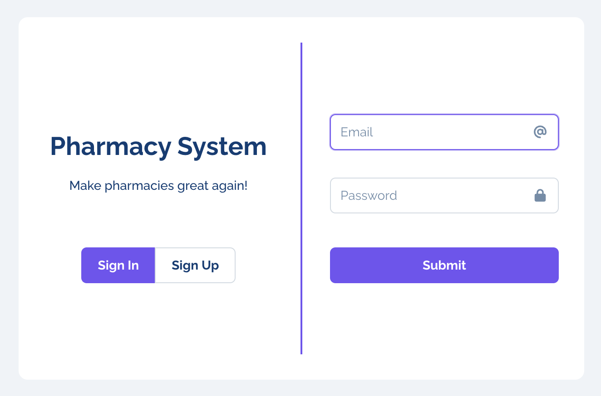
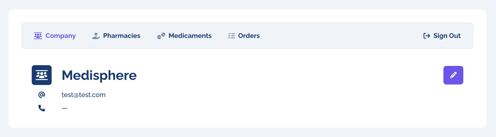
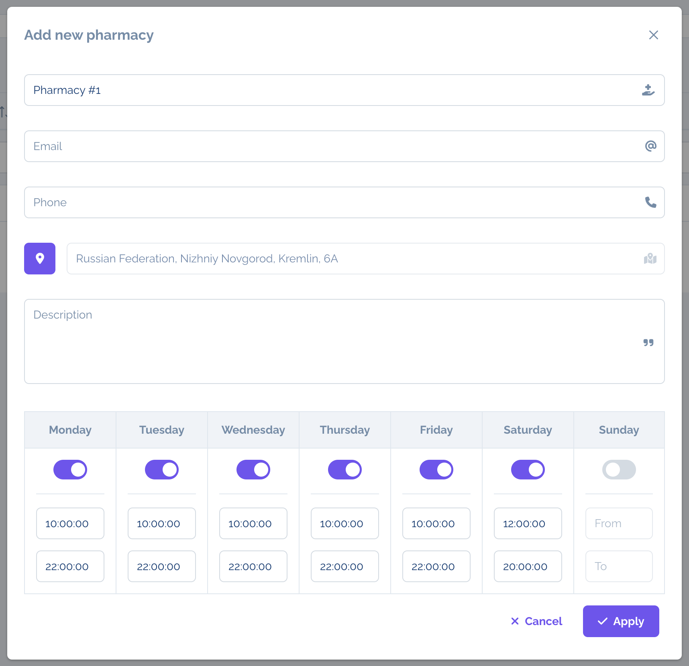
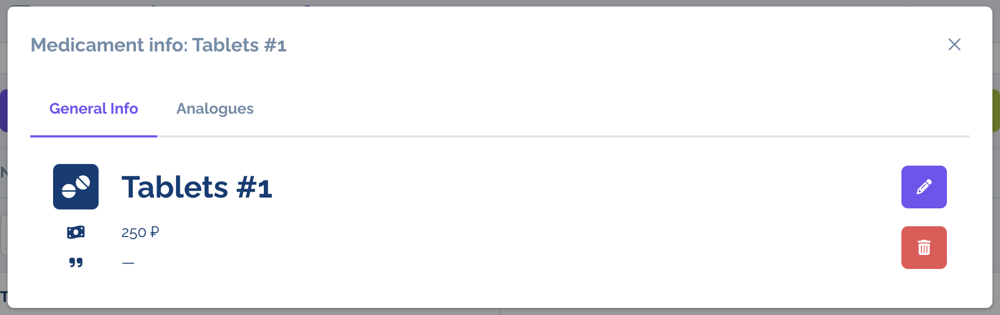
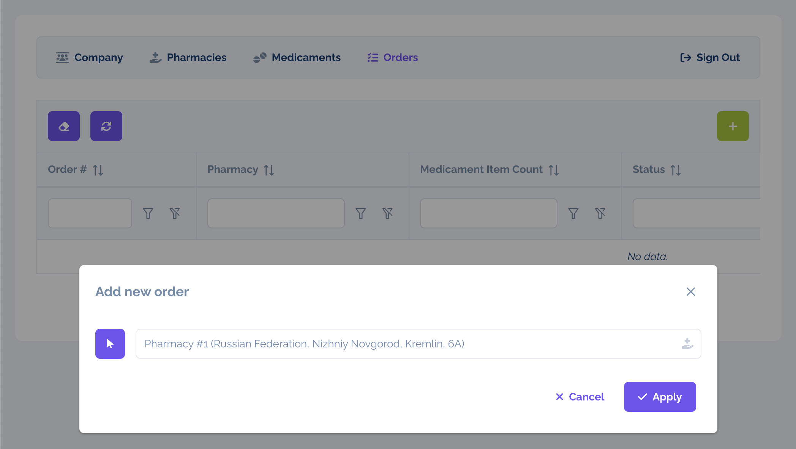
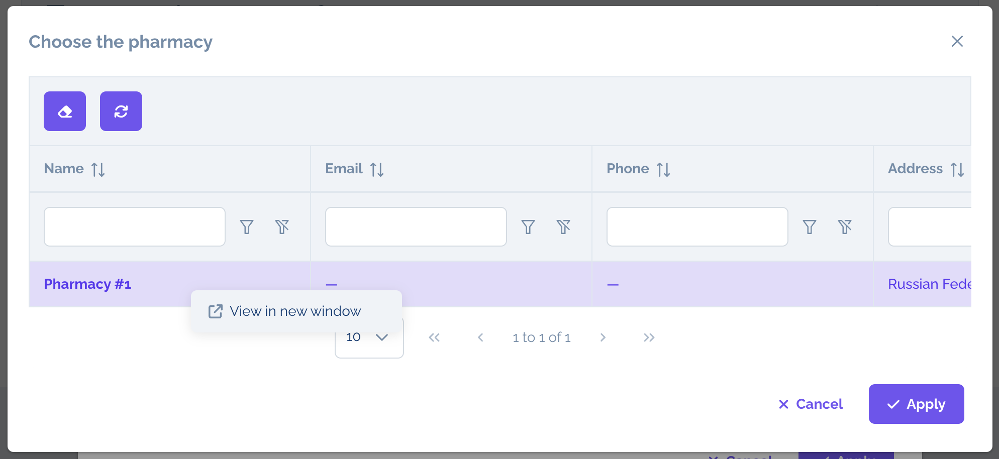
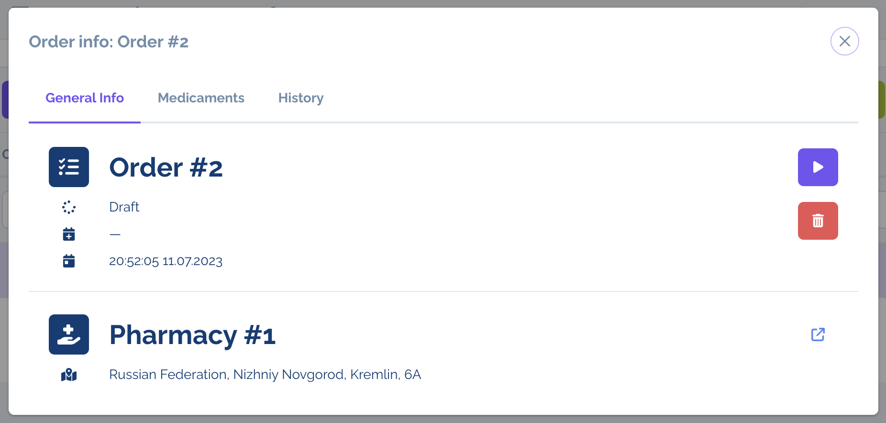

# Pharmacy System

The prototype of the system for a company management of pharmacy and medicament items using order-sale mechanism.

## Code structure

The system consists of the following components:

1. .NET solution:
    - [Database](#database)
    - [WebAPI / Backend](#webapi--backend)
2. Node.js:
    - [UI / Frontend](#ui--frontend)

### Database

#### 1. DBMS

|  Architecture   |   Supported tool    | Pre-configured Docker Compose service                                        |
|:---------------:|:-------------------:|:-----------------------------------------------------------------------------|
| **x64 / amd64** | **SQL Server 2022** | `mssql` from [`docker-compose.x64-amd64.yml`](docker-compose.x64-amd64.yml)  |
|    **arm64**    | **Azure SQL Edge**  | `azure-sql-edge` from [`docker-compose.arm64.yml`](docker-compose.arm64.yml) |

#### 2. SQL project

> It's the non-executable project for suitable management of a DB structure through SQL scripts. Generates DACPAC file to compare an existing DB model and apply required changes only.

- Located in [Database](Database) folder
- Based on **.NET Standard 2.1**, written in **SQL**
    - Uses [MSBuild.Sdk.SqlProj](https://github.com/rr-wfm/MSBuild.Sdk.SqlProj) for DACPAC creation

### WebAPI / Backend

> It's the RESTful API service for data management from [UI pages (frontend)](#ui--frontend).
>
> _Note:_ this service publishes [the database project](#2-sql-project) automatically on startup each time.

- Located in [WebAPI](WebAPI) folder
- Based on **.NET 7.0**, written in **C# 11**
    - Uses ASP.NET for Web app
    - Uses Microsoft.SqlServer.DacFx for DB publishing
    - Uses [Dapper](https://github.com/DapperLib/Dapper) for SQL querying
- Links [**FOR DEVELOPMENT ONLY!**]:
    - [Manually launched](#1-manually): https://localhost:7176 and http://localhost:5078
    - [Launched via Docker](#2-docker): http://localhost:80

### UI / Frontend

> It's the UI representation using [the API service (backend)](#webapi--backend).

- Located in [UI](UI) folder
- Based on **Node.js 20** with **Vite** and **Vue 3**, written in **JavaScript**
    - Uses [Primevue UI framework](https://primevue.org/)
    - Uses [Raleway Font](https://fonts.google.com/specimen/Raleway)
    - Uses [Font Awesome Free Icons](https://fontawesome.com/search?o=r&m=free)
    - Uses [vue-yandex-maps](https://github.com/PNKBizz/vue-yandex-map)
- Links [**FOR DEVELOPMENT ONLY!**]:
    - [Manually launched](#1-manually): http://localhost:5173
    - [Launched via Docker](#2-docker): http://localhost:5173

## How to launch and stop applications?

First of all, change current directory in the terminal to the repository root.

⚠️ The UI component uses [Yandex Maps](https://yandex.ru/dev/maps/jsapi/doc/2.1/quick-start/index.html) for a pharmacy profile view. So, pay attention to API key details below.

### 1. Manually

Before to start, make sure .NET 7.0 and Node.js 20 are installed on the host and are able to work.

#### 1.1. Database Connection

To use DB outside an IDE (_in case of ignoring `launchSettings.json` props and `appsettings.Development.json` config_), specify `DATABASE_CONNECTION_STRING` environment variable in the terminal tab
where the backend app should launched.

##### 1.1.1. Windows

```console
set DATABASE_CONNECTION_STRING=<...>
```

##### 1.1.2. Linux/macOS

```console
export DATABASE_CONNECTION_STRING=<...>
```

#### 1.2. Yandex Maps API key

To setup Yandex Maps for UI component as it was mentioned above, specify `VITE_YAMAPS_API_KEY` environment variable in the terminal tab where the frontend app should launched.

##### 1.2.1. Windows

```console
set VITE_YAMAPS_API_KEY=<...>
```

##### 1.2.2. Linux/macOS

```console
export VITE_YAMAPS_API_KEY=<...>
```

#### 1.3. Commands

##### 1.3.1. Backend app

- Go to `WebAPI` directory in the terminal tab for the **backend** app:

```console
cd WebAPI/
```

- Build the API service:

```console
dotnet build "WebAPI.csproj" -c Debug -o build
```

- Run the API service:

```console
dotnet build/PharmacySystem.WebAPI.dll
```

##### 1.3.2. Frontend app

- Go to `UI` directory in the terminal tab for the **frontend** app:

```console
cd UI/
```

- Install NPM dependencies:

```console
npm install
```

- Run the UI service:

```console
npm run dev
```

##### 1.3.3 Common

In order to stop applications, press `^ + C` / `CTRL + C` in necessary terminal tabs.

### 2. Docker

Before to start, make sure Docker Daemon works correctly on the proposed host and has already been started.
Also the first launch and rebuild require downloading of required components from the Docker Compose configuration that takes a couple minutes.

#### 2.1. Yandex Maps API key

To setup Yandex Maps for UI component as it was mentioned above, specify `YAMAPS_API_KEY` environment variable in the current terminal tab.

##### 2.1.1. Windows

```console
set YAMAPS_API_KEY=<...>
```

##### 2.1.2. Linux/macOS

```console
export YAMAPS_API_KEY=<...>
```

#### 2.2. Commands

##### 2.2.1. x64-amd64

- Launch applications:

```console
docker compose -f docker-compose.x64-amd64.yml up [-d]
```

> _Example of output:_
>
> ```
> PharmacySystem/ > docker compose -f docker-compose.x64-amd64.yml up -d
> ...
> 
> [+] Running 4/4
>  ✔ Network pharmacysystem_default       Created   0.0s
>  ✔ Container pharmacysystem-mssql-1     Healthy   5.8s
>  ✔ Container pharmacysystem-backend-1   Healthy   16.4s
>  ✔ Container pharmacysystem-frontend-1  Started   16.5s
> 
> PharmacySystem/ > _
> ```

- Stop applications:

```console
docker compose -f docker-compose.x64-amd64.yml down
```

> _Example of output:_
>
> ```
> PharmacySystem/ > docker compose -f docker-compose.x64-amd64.yml down
> ...
> 
> [+] Running 4/3
>  ✔ Container pharmacysystem-frontend-1  Removed   10.2s
>  ✔ Container pharmacysystem-backend-1   Removed   0.1s
>  ✔ Container pharmacysystem-mssql-1     Removed   10.2s
>  ✔ Network pharmacysystem_default       Removed   0.1s
> 
> PharmacySystem/ > _
> ```

##### 2.2.1. arm64

- Launch applications:

```console
docker compose -f docker-compose.arm64.yml up [-d]
```

> _Example of output:_
>
> ```
> PharmacySystem/ > docker compose -f docker-compose.arm64.yml up -d
> ...
> 
> [+] Running 4/4
>  ✔ Network pharmacysystem_default             Created   0.0s 
>  ✔ Container pharmacysystem-azure-sql-edge-1  Healthy   5.8s 
>  ✔ Container pharmacysystem-backend-1         Healthy   16.4s 
>  ✔ Container pharmacysystem-frontend-1        Started   16.5s 
> 
> PharmacySystem/ > _
> ```

- Stop applications:

```console
docker compose -f docker-compose.arm64.yml down
```

> _Example of output:_
>
> ```
> PharmacySystem/ > docker compose -f docker-compose.arm64.yml down
> ...
> 
> [+] Running 4/3
>  ✔ Container pharmacysystem-frontend-1        Removed   10.2s
>  ✔ Container pharmacysystem-backend-1         Removed   0.1s
>  ✔ Container pharmacysystem-azure-sql-edge-1  Removed   10.2s
>  ✔ Network pharmacysystem_default             Removed   0.1s
> 
> PharmacySystem/ > _
> ```

## Screenshots

A set of screens from the system UI forms and views is represented below:

<table style="width: 100%">
    <colgroup>
        <col style="width: 25%" />
    </colgroup>
    <tbody>
        <tr>
            <td>'<b>Sign In</b>' form</td>
            <td></td>
        </tr>
        <tr>
            <td>'<b>Company Info</b>' view</td>
            <td></td>
        </tr>
        <tr>
            <td>'<b>Edit Pharmacy Info</b>' form</td>
            <td></td>
        </tr>
        <tr>
            <td>'<b>Medicament Info</b>' view</td>
            <td></td>
        </tr>
        <tr>
            <td>'<b>Create Order</b>' form</td>
            <td></td>
        </tr>
        <tr>
            <td>'<b>Choose Pharmacy for Order</b>' form</td>
            <td></td>
        </tr>
        <tr>
            <td>'<b>Order Info</b>' view</td>
            <td></td>
        </tr>
    </tbody>
</table>

## License

This project is licensed under the MIT License. See the LICENSE file for details.
